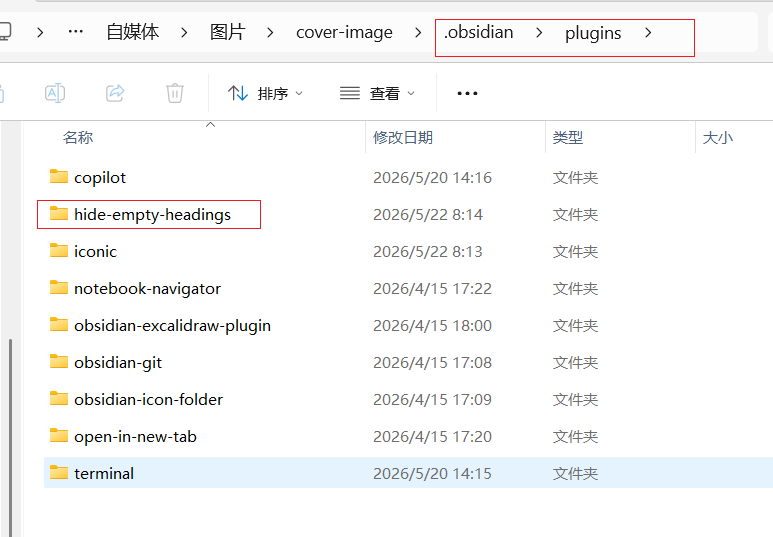

# Hide Empty Headings - 小白入门指南

## 这个插件的由来

> 一个小插件，背后是3个小时的踩坑和一次勇敢的尝试。

### 缘起

这个插件源于一位客户的需求。

客户的痛点很简单：在Obsidian阅读模式下，那些"只有标题没有内容"的空章节太碍眼了。他不想删除这些标题（因为还要用），但也不想看到它们。

看起来是个简单的需求，对吧？

### 踩坑3小时

我一开始也这么想。

然后我开始了漫长的尝试：

| 方案 | 结果 |
|------|------|
| CSS snippet | ❌ 无法判断标题下是否有内容 |
| Dataview查询 | ❌ 只能查询，不能控制显示 |
| CustomJS脚本 | ❌ 调用时机有问题 |
| 修改主题 | ❌ 主题不支持这种逻辑 |

一个小时过去了，两个小时过去了，三个小时过去了......

各种方案试了个遍，没一个能完美解决。

### 为什么没想到写插件？

说实话，因为我**从来没写过Obsidian插件**。

对我来说，写插件是个"高门槛"的事情：
- 需要学习Obsidian API
- 需要了解TypeScript
- 需要搭建开发环境
- 需要发布到市场

这些都是我之前没做过的。

### AI来了

但这次，我决定试一试。

不是因为我突然变厉害了，而是因为我有了**AI助手**。

从零开始，我：
1. 跟AI说清楚需求
2. AI帮我生成代码
3. 我测试、反馈问题
4. AI帮我修改
5. 循环往复......

前后大概1个小时，插件就写好了。

### 从0到1

这是我人生中**第一个**Obsidian插件。

以前我觉得写插件很难，需要很多前置知识。但这次经历让我发现：

> 有了AI，写插件真的没那么难。难的是你愿不愿意迈出第一步。

### 这个插件的特点

- **零配置**：安装即用，不需要任何设置
- **智能判断**：能识别子标题是否有内容
- **轻量级**：只在需要时运行，不影响性能
- **安全可靠**：不修改你的笔记文件，只做视觉隐藏

---

## 目录
- [什么是Obsidian](#什么是obsidian)
- [这个插件是做什么的](#这个插件是做什么的)
- [为什么你需要这个插件](#为什么你需要这个插件)
- [安装步骤](#安装步骤)
- [如何使用](#如何使用)
- [常见问题](#常见问题)

---

## 什么是Obsidian

Obsidian 是一款**免费**的笔记软件，类似于 Notion、语雀，但更专注于个人知识管理。

### Obsidian 的核心概念

```
Obsidian 笔记 = Markdown 文件（.md）
├── 存储在你本地电脑上
├── 用任何文本编辑器都能打开
└── 永远属于你，不会丢失
```

**简单说**：Obsidian 就是一个能让你在本地管理笔记的工具，支持Markdown语法，可以添加各种插件扩展功能。

---

## 这个插件是做什么的

**一句话说明**：自动隐藏那些"只有标题、没有内容"的空章节。

### 举个例子

假设你写了这样一篇笔记：

```markdown
# 我的学习笔记

## 第一章：JavaScript基础
（这里有一些内容...）

## 第二章：React入门
（这里有一些内容...）

## 第三章：Vue入门
（空的，还没写）

## 第四章：总结
（空的，还没写）
```

**使用插件前**：
```
┌─────────────────────────┐
│  我的学习笔记           │
├─────────────────────────┤
│  第一章：JavaScript基础 │ ← 有内容
│  第二章：React入门      │ ← 有内容
│  第三章：Vue入门        │ ← 空的（显示出来）
│  第四章：总结           │ ← 空的（显示出来）
└─────────────────────────┘
```

**使用插件后**：
```
┌─────────────────────────┐
│  我的学习笔记           │
├─────────────────────────┤
│  第一章：JavaScript基础 │ ← 有内容
│  第二章：React入门      │ ← 有内容
│  (空标题自动隐藏了！)    │
└─────────────────────────┘
```

### 功能特点

| 特点 | 说明 |
|------|------|
| ✅ 自动隐藏 | 标题下方无内容时自动隐藏 |
| ✅ 实时生效 | 切换笔记时自动检测 |
| ✅ 无需配置 | 安装后直接使用 |
| ✅ 智能判断 | 能识别子标题是否有内容 |

---

## 为什么你需要这个插件

### 场景1：还在写的笔记
你正在写一篇笔记，先搭好了大纲框架，但某些章节还没写完。

**问题**：这些空标题占地方，看着碍眼，但你又不想删掉框架。

**解决**：这个插件会自动隐藏它们，等你写完了自动显示。

### 场景2：模板笔记
你用模板创建笔记，模板里预设了很多标题，但大部分用不上。

**问题**：每个笔记打开都有一堆空标题。

**解决**：插件自动隐藏没用到的标题。

### 场景3：学习大纲
你在整理知识体系，先建立框架再填充内容。

**问题**：框架显示一堆空标题，影响阅读。

**解决**：只显示有内容的章节，更清晰。

---

## 安装步骤

### 方法1：手动安装（推荐）

1. **找到Obsidian插件文件夹**

   打开你的Obsidian仓库（vault）文件夹，找到 `.obsidian\plugins` 目录：
   ```
   你的仓库文件夹/
   └── .obsidian/
       └── plugins/  ← 把插件放这里
   ```

2. **复制插件文件夹**

   把 `hide-empty-headings` 文件夹复制到 `plugins` 目录下：
   ```
   .obsidian/plugins/
   └── hide-empty-headings/
       ├── main.js
       └── manifest.json
   ```

3. **启用插件**

   - 打开Obsidian
   - 点击左下角 ⚙️ 设置
   - 点击「第三方插件」
   - 找到「Hide Empty Headings」
   - 点击开关启用它

   

---

## 如何使用

### 零配置，开箱即用

安装并启用后，插件就自动工作了。你不需要任何设置。

### 验证是否生效

1. 打开一篇有空标题的笔记
2. 切换到**阅读模式**（快捷键 `Ctrl+E` 或点击右上角的阅读图标）
3. 观察那些空标题是否消失了

```
编辑模式（正常显示）     阅读模式（空标题隐藏）
┌──────────────┐        ┌──────────────┐
│ 有内容的标题  │        │ 有内容的标题  │
│ 空标题       │   →    │ (已隐藏)      │
│ 有内容的标题  │        │ 有内容的标题  │
└──────────────┘        └──────────────┘
```

### 支持的标题层级

插件支持所有Markdown标题层级：
- `#` 一级标题
- `##` 二级标题
- `###` 三级标题
- `####` 四级标题
- `#####` 五级标题
- `######` 六级标题

---

## 常见问题

### Q1：为什么我的标题没有隐藏？

**检查以下几点**：
- ✅ 确保在**阅读模式**下查看（不是编辑模式）
- ✅ 确保插件已经启用（设置 → 第三方插件）
- ✅ 确保标题下方真的没有内容（包括空行）

### Q2：编辑模式下会隐藏吗？

不会。插件只在**阅读模式**下工作，编辑模式下所有标题都会正常显示。

### Q3：隐藏的标题内容会丢失吗？

**绝对不会**。插件只是视觉上隐藏了标题，你的笔记文件没有任何改变。关闭阅读模式或切换到编辑模式，所有内容都还在。

### Q4：子标题有内容，父标题会隐藏吗？

不会。插件是智能的，如果一个标题下的子标题有内容，父标题不会被隐藏。

```markdown
## 第一章（空）
### 1.1 小节（有内容）
```

这种情况下，「第一章」不会被隐藏，因为它下面的小节有内容。

### Q5：如何临时关闭插件？

进入设置 → 第三方插件 → 找到插件 → 关闭开关即可。

### Q6：支持哪些Obsidian版本？

最低要求 Obsidian 0.15.0（2022年9月以后的版本都支持）。

---

## 作者信息

- **作者**：醒醒
- **网站**：https://xingxing.aigongxue.cfd/
- **邮箱**：2430486030@qq.com
- **定位**：全栈程序员，独立开发，All in AI

---

## 反馈与支持

遇到问题或有功能建议？欢迎联系作者！

📧 邮箱：2430486030@qq.com
